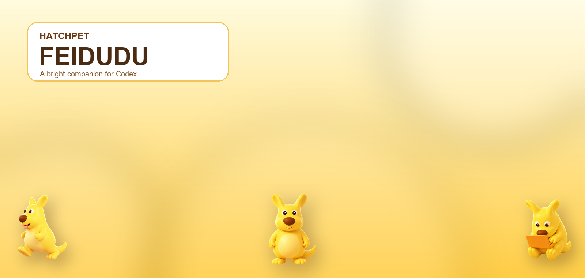
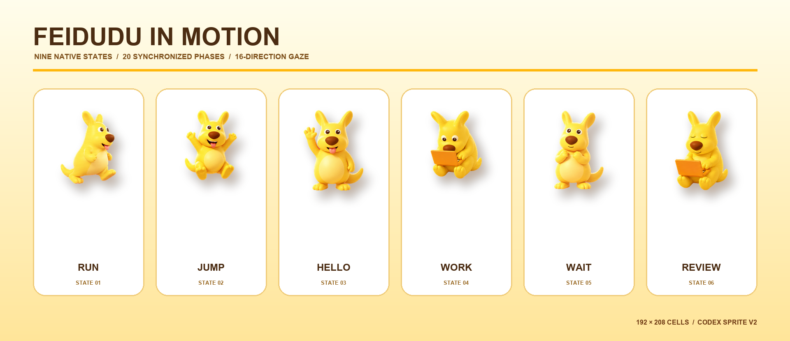
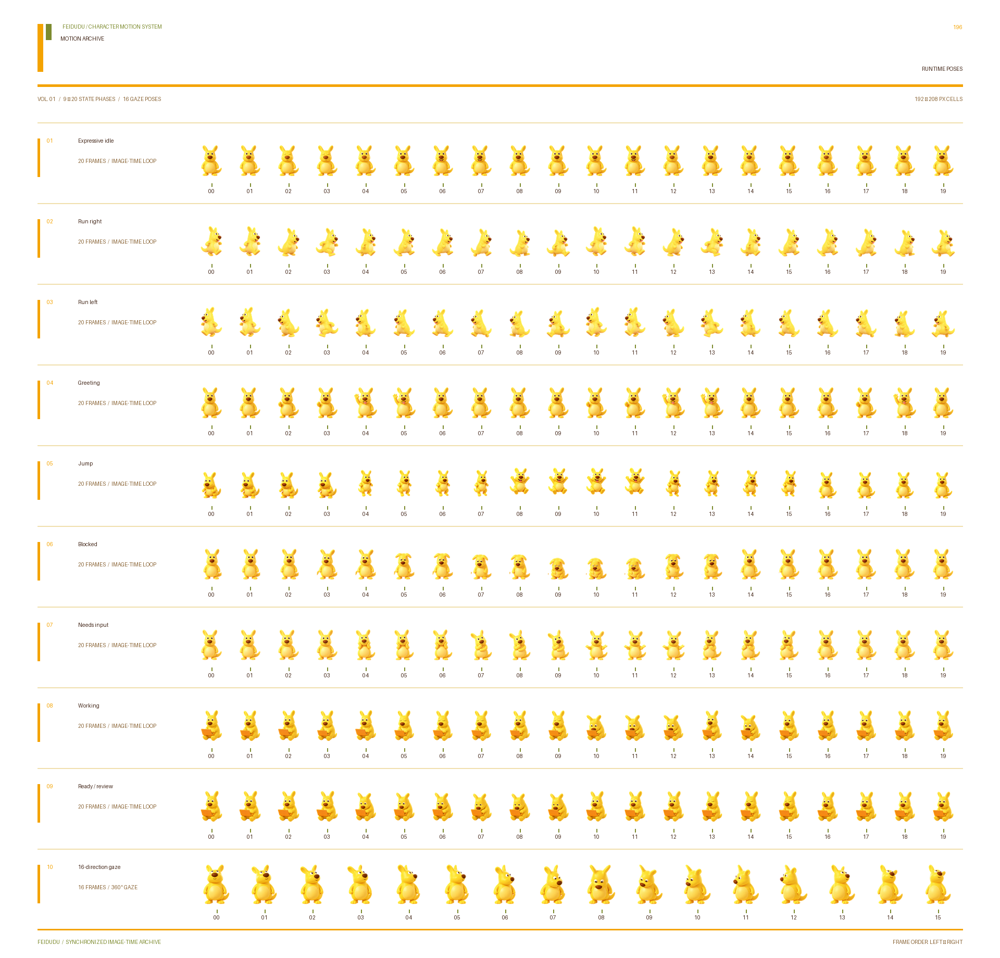

<p align="center">
  
</p>

<p align="center">
  <strong>一只会在 Codex 工作时作出回应的快乐金黄色伙伴。</strong><br>
  <a href="README.md">English</a> · <a href="操作手册与说明.md">中文操作手册与说明</a>
</p>
# HatchPet：肥嘟嘟

> 提示：思路和源代码参考项目 https://github.com/srwang0506/HatchPet-CapybaraLulu.git

肥嘟嘟（Feidudu）是一套自定义桌宠包，沿用源 HatchPet 项目的 Codex Sprite V2 工作流制作。角色依据用户提供的九张视觉参考图设计：金黄色、梨形胖身体、两只长耳朵、奶油色肚皮、硕大的红棕色鼻子、圆眼睛、两只短手、两只脚和一条弯曲尾巴。

可直接安装的桌宠包位于 [`pet/`](pet/)；其中只有一个小型清单文件和一张动态 WebP 图集，不需要后台服务、网络请求或第三方可执行程序。

<p align="center">
  
</p>

## 主要特性

- 九种 Codex 原生状态：待机、向右跑、向左跑、打招呼、跳跃、受阻、等待输入、工作中、等待审阅。
- 20 个同步图像时间相位，每相位 80ms，形成无缝的 1.60 秒全局循环。
- 在原生状态内部编排了 15 段可见动作。
- 两条 Sprite V2 注视行覆盖 16 个方向。
- 透明 192 × 208 单元格，图集规格为 8 × 11、1536 × 2288。
- 提供静态 RGBA 备用图集，适合减少动态效果或调试。
- 保留完整源行、拆分帧、预览、验证报告和构建脚本。

## 快速开始

### 环境要求

- Windows、macOS 或 Linux
- Python 3.10 或更高版本
- 支持自定义桌宠的 ChatGPT/Codex 客户端

只有在重新构建或验证素材时才需要 Pillow：

```bash
python -m pip install -r requirements.txt
```

### 安装

在项目根目录运行：

```bash
python scripts/install.py
```

如果系统中的 Python 3 命令是 `python3`：

```bash
python3 scripts/install.py
```

安装器会：

1. 校验肥嘟嘟的 Sprite V2 清单；
2. 将已有的 `feidudu` 安装备份到 `~/.codex/backups/feidudu/`；
3. 把桌宠复制到 `~/.codex/pets/feidudu/`；
4. 除非传入 `--no-select`，否则把 `[desktop].selected-avatar-id` 设置为 `custom:feidudu`。

完全退出并重新打开桌面客户端；如未自动启用，请打开 **Settings → Pets（设置 → Pets）**，选择 **肥嘟嘟**。

只安装、不更改当前桌宠：

```bash
python scripts/install.py --no-select
```

在临时目录中测试安装、完全不触碰真实 Codex 目录：

```bash
python scripts/install.py --codex-home .tmp-codex
```

## 状态行为

| 图集行 | 原生状态 | 肥嘟嘟的动作 |
|---:|---|---|
| 0 | `idle` | 呼吸、眨眼、变换口型并轻轻回稳 |
| 1 | `running-right` | 两轮完整的向右步态 |
| 2 | `running-left` | 逐帧镜像且相位一致的向左步态 |
| 3 | `waving` | 抬起一只手向用户打招呼 |
| 4 | `jumping` | 蓄力、起跳、到达最高点并落地 |
| 5 | `failed` | 在任务受阻或失败时作出反应 |
| 6 | `waiting` | 等待用户输入并请求关注 |
| 7 | `running` | 使用固定的橙色笔记本电脑工作 |
| 8 | `review` | 在同一台笔记本电脑前等待审阅 |
| 9–10 | 指针注视 | 以 22.5° 为步进覆盖 000° 到 337.5° |

九个原生状态行共享同一个动态 WebP 时钟。进入状态不会重置时钟，因此每条状态序列都被设计为任意相位进入也能连续循环。两条注视行在所有时间帧中保持完全不变，保证指针跟随稳定。

## 动作档案

<p align="center">
  
</p>

透明独立帧位于 [`assets/frames/`](assets/frames/)，同步运行相位位于 [`assets/state-phases/`](assets/state-phases/)，轻量动画预览位于 [`assets/gifs/`](assets/gifs/)。

九张参考图和生成阶段的工作图分别保留在 [`references/source-images/`](references/source-images/) 与 [`assets/source/`](assets/source/) 中，方便以后按同一角色规范复核改动。最终采用的内置图像生成提示词集合记录在 [`references/IMAGEGEN-PROMPTS.md`](references/IMAGEGEN-PROMPTS.md)。

## Sprite V2 规格

| 属性 | 数值 |
|---|---:|
| 列数 | 8 |
| 行数 | 11 |
| 单元格 | 192 × 208 px |
| 图集 | 1536 × 2288 px |
| 运行帧数 | 20 |
| 单帧时长 | 80 ms |
| 循环时长 | 1600 ms |
| Sprite 版本 | 2 |

正式动态图集为 [`pet/spritesheet.webp`](pet/spritesheet.webp)，静态备用图集为 [`assets/spritesheet-static.webp`](assets/spritesheet-static.webp)，[`assets/state-phases.json`](assets/state-phases.json) 是打包运行文件时使用的精确相位映射。

## 减少动态效果

静态图集拥有相同的 8 × 11 几何结构，可以在不修改 `pet.json` 的情况下替换动态图集：

```bash
cp assets/spritesheet-static.webp ~/.codex/pets/feidudu/spritesheet.webp
```

PowerShell：

```powershell
Copy-Item assets\spritesheet-static.webp "$HOME\.codex\pets\feidudu\spritesheet.webp" -Force
```

替换后请重启客户端。再次运行安装器即可恢复动态版本。

## 重建与验证

仓库同时保留原项目的通用 `hatch-pet` 工具和肥嘟嘟专用的归一化辅助脚本。

根据已签入的静态与动态图集重建文档展示图：

```bash
python scripts/build_gallery.py
python scripts/build_readme_assets.py
```

验证静态图集：

```bash
python hatch-pet/scripts/validate_atlas.py assets/spritesheet-static.webp \
  --json-out assets/validation-static-feidudu.json --require-v2
```

验证动态图集及其精确相位映射：

```bash
python hatch-pet/scripts/validate_atlas.py pet/spritesheet.webp \
  --json-out assets/validation-runtime-feidudu.json \
  --require-v2 --allow-animated --allow-transparent-rgb-residue

python hatch-pet/scripts/validate_smooth_state_webp.py pet/spritesheet.webp \
  --source-atlas assets/spritesheet-static.webp \
  --phase-manifest assets/state-phases.json \
  --json-out assets/validation-smooth-feidudu.json \
  --require-all-states --min-motion-clips 12 --max-motion-clips 15
```

运行通用工具测试：

```bash
python -m unittest discover -s hatch-pet/tests -v
```

## 项目结构

```text
HatchPet-Feidudu-main/
├── pet/                         # 可直接安装的肥嘟嘟桌宠包
│   ├── pet.json
│   └── spritesheet.webp
├── assets/
│   ├── source/                  # 生成的色键源行与角色基准图
│   ├── frames/                  # 透明静态源帧
│   ├── state-phases/            # 每种状态的 20 个运行相位
│   ├── gifs/                    # 轻量状态预览
│   ├── runtime-previews/        # 相位表与动态 WebP 预览
│   ├── spritesheet-static.webp  # 减少动态效果/调试图集
│   └── state-phases.json        # 运行相位映射
├── references/source-images/    # 九张参考图与联系表
├── hatch-pet/                   # 可复用 Sprite V2 构建和质检工具
├── scripts/                     # 肥嘟嘟构建、展示与安装脚本
├── README.md                    # 英文项目说明
├── README.zh-CN.md              # 本中文翻译
└── 操作手册与说明.md              # 详细中文用户手册
```

## 角色与贡献规则

请保持肥嘟嘟的核心轮廓和解剖结构：金黄色梨形身体、两只长耳、奶油色椭圆肚皮、超大的红棕色椭圆鼻子、圆眼睛、恰好两只手、两只脚和一条弯尾巴。默认形象不穿衣服。橙色笔记本电脑只用于工作与审阅状态；爱心属于可选表情道具，不是基础身份的一部分。

修改动作或打包逻辑前，请阅读 [`AGENTS.md`](AGENTS.md) 和 [`CONTRIBUTING.md`](CONTRIBUTING.md)。

## 参考图与分发说明

九张用户提供的图片仅作为角色设计参考，其中可能包含第三方平台标记或作者信息；生成的桌宠素材没有保留这些标记。再次分发参考文件或衍生美术前，请确认你拥有所需权利。仓库说明见 [`NOTICE`](NOTICE)。

## 许可证

项目代码遵循 [`LICENSE`](LICENSE) 中的许可条款。美术素材与用户提供的参考图可能适用不同权利，请在分发前阅读 [`NOTICE`](NOTICE)。
